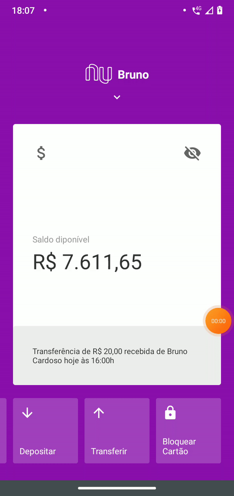

A clone of initial screen of Nubank mobile app.
Initialized using [Basic Rocketseat Template](https://github.com/Rocketseat/react-native-template-rocketseat-basic).

## How can I run it?

Clone the project.
In the project directory, you can run:

### `npm install`

or

### `yarn install`

and than run:

### `react-native run-(android/ios)`

or

### `yarn (android/ios)`

Than you will get this:

